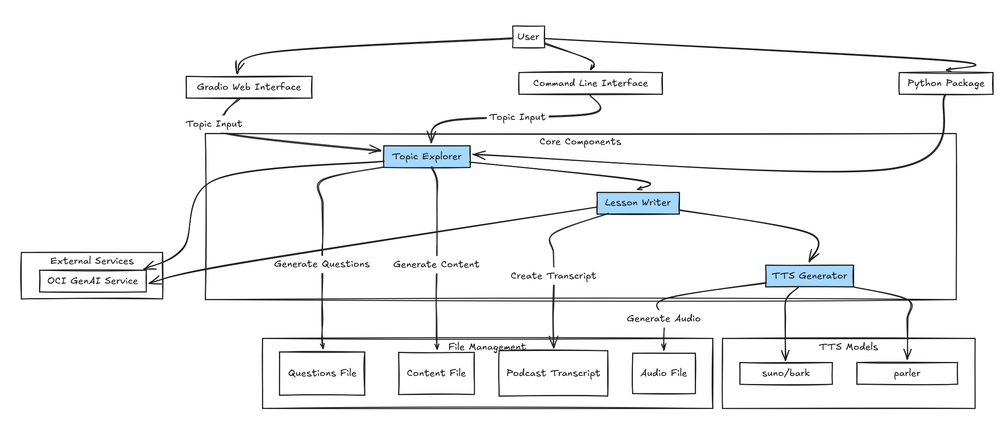
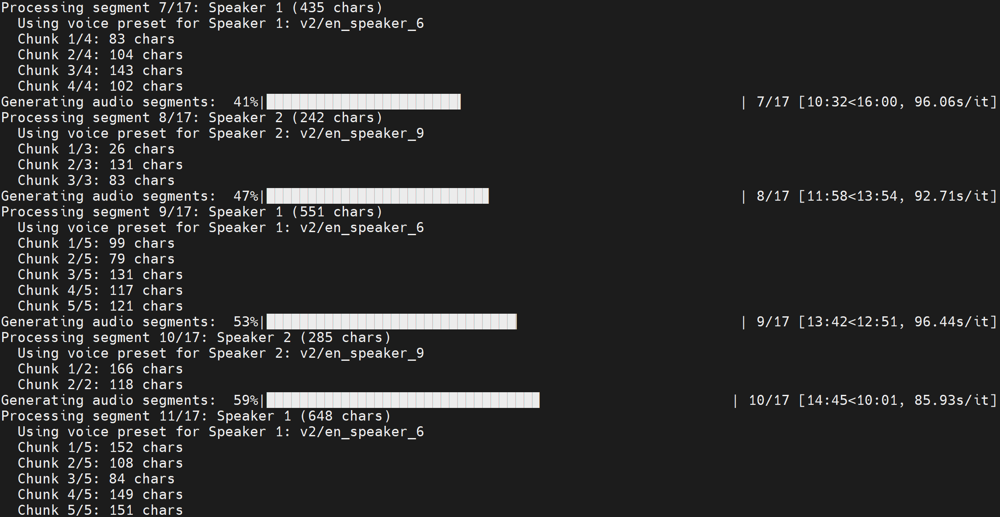

# planeLLM: Bite-sized podcasts to learn about anything powered by the OCI GenAI Service

## Introduction

planeLLM is a Python application that uses the OCI GenAI service to generate bite-sized podcasts to learn about anything. It's a simple and easy-to-use tool that allows you to generate podcasts on any topic you want!



The solution has the following features:

- Topic Explorer: Generate educational content about any topic
- Lesson Writer: Convert content into podcast transcript format
- TTS Generator: Generate audio from the transcript
- Gradio interface: A user-friendly interface to interact with the application
- File management: Automatically save all generated files to the `./resources` directory with timestamps, so you can reuse them without having to re-run the app

## 0. Prerequisites and setup

### Prerequisites

- Python 3.8 or higher
- Install [OCI CLI](https://docs.oracle.com/en-us/iaas/Content/API/SDKDocs/cliinstall.htm)
- OCI Generative AI service enabled in your OCI tenancy

### Setup

1. Once you have installed OCI CLI, you'll need to create a profile to authenticate with OCI services. Run the following command with your OCI login information:

   ```bash
   oci setup config
   ```

2. Clone the repository and install dependencies (including `ffmpeg`):

    ```bash
    git clone https://github.com/oracle-devrel/devrel-labs.git
    cd planeLLM
    pip install -r requirements.txt
    sudo apt-get install ffmpeg
    # if you are on Windows or another OS different than Ubuntu, install ffmpeg from https://ffmpeg.org/download.html
    ```

3. In `config.yaml`, you will need to complete these variables:

   ```yaml
   # OCI Configuration
   compartment_id: "compartment_ocid"
   config_profile: "profile_name"
   model_id: "model_ocid"
   ```

   > **Note**: You can find the model OCID by going to the OCI GenAI service console and clicking on the model you want to use (you have Llama 3.1 and 3.3 OCIDs in config_example.yaml)

## 1. Run the application

### Option 1: Gradio Web Interface (Recommended)

Run the Gradio web interface for an interactive experience:

```bash
python gradio_app.py
```

The interface provides three tabs:

1. **Topic Explorer**: Generate educational content about any topic
2. **Lesson Writer**: Convert content into podcast transcript format
3. **TTS Generator**: Generate audio from the transcript

Here's a list of features for the Gradio interface:

- **User-friendly interface** with progress indicators
- **File management** with automatic saving and timestamping
- **Component integration** allowing seamless workflow between steps
- **TTS model selection** between Bark (higher quality), Parler (faster), and Coqui (high quality with natural intonation)
- **Real-time feedback** on generation progress

You can check out the result of using the Gradio interface in this audio file:

[Sample audio output](./outputs/podcast_example_output.mp3)

#### Topic Explorer

This tab allows you to:
- Enter any topic you want to learn about
- Generate educational questions and content
- View the generated questions and content
- Save the results to files with timestamps

The topic explorer generates more structured, educational questions and creates more engaging, informative content with examples and analogies.

#### Lesson Writer

This tab allows you to:
- Select a content file generated by the Topic Explorer
- Convert the content into a podcast transcript format
- Choose between standard and detailed processing modes
- View the generated transcript
- Save the transcript to a file with a timestamp

The lesson writer produces more natural, conversational podcast transcripts with better transitions, examples, and educational elements.

#### TTS Generator

This tab allows you to:
- Select a transcript file generated by the Lesson Writer
- Choose a TTS model (Bark, Parler, or Coqui)
- Generate audio from the transcript
- Play the generated audio directly in the browser
- Save the audio to an MP3 file with a timestamp



#### File Management

All generated files are saved in the `./resources` directory with timestamps:
- Questions: `questions_YYYYMMDD_HHMMSS.txt`
- Content: `content_YYYYMMDD_HHMMSS.txt`
- Transcripts: `podcast_transcript_YYYYMMDD_HHMMSS.txt`
- Detailed Transcripts: `podcast_transcript_detailed_YYYYMMDD_HHMMSS.txt`
- Audio: `podcast_YYYYMMDD_HHMMSS.mp3`

### Option 2: Unified Pipeline

Run the entire pipeline with a single command:
```bash
python podcast_controller.py --topic "Ancient Rome"
```

Additional options:
```bash
# Use a different TTS model
python podcast_controller.py --topic "Ancient Rome" --tts-model parler
# Or use Coqui TTS
python podcast_controller.py --topic "Ancient Rome" --tts-model coqui

# Specify a different config file
python podcast_controller.py --topic "Ancient Rome" --config my_config.yaml

# Process each question individually for more detailed content
python podcast_controller.py --topic "Ancient Rome" --detailed-transcript
```

### Option 3: Using as a Package

You can also use planeLLM as a Python package:

```python
from topic_explorer import TopicExplorer
from lesson_writer import PodcastWriter
from tts_generator import TTSGenerator

# Generate educational content
explorer = TopicExplorer()
content = explorer.generate_full_content("Ancient Rome")

# Create standard podcast transcript
writer = PodcastWriter()
transcript = writer.create_podcast_transcript(content)

# For more detailed transcripts, process each question individually
writer = PodcastWriter()
detailed_transcript = writer.create_detailed_podcast_transcript(content)

# Initialize the TTS generator with your preferred model
generator = TTSGenerator(model_type="bark")  # or "parler" or "coqui"

# Generate podcast from a transcript file
output_path = generator.generate_podcast(transcript, output_path="./resources/podcast.mp3")

# Or generate from transcript text directly
transcript_text = """
Speaker 1: Welcome to our podcast about quantum computing!
Speaker 2: I'm excited to learn about this topic. What is quantum computing?
Speaker 1: Quantum computing uses quantum mechanics to perform calculations...
"""
output_path = generator.generate_podcast(transcript_text, output_path="./resources/quantum_podcast.mp3")
```

## Core Components

The project consists of three main modules:

1. **Topic Explorer** (`topic_explorer.py`): Generates educational content about a topic using OCI GenAI service
   - Generates relevant questions about the topic
   - Creates detailed answers for each question
   - Saves questions and content to separate files

2. **Lesson Writer** (`lesson_writer.py`): Transforms educational content into podcast format
   - Converts raw content into a conversational format
   - Supports 2 or 3 speakers
   - Creates natural dialogue between expert(s) and student
   - Provides detailed processing mode for question-by-question content generation

3. **TTS Generator** (`tts_generator.py`): Converts podcast transcripts to audio
   - Supports multiple TTS models (Bark, Parler, and Coqui)
   - Handles speaker separation for natural-sounding conversations

## Annex: Testing

The project includes comprehensive unit tests for all modules. To run the tests:

```bash
# Install test dependencies
pip install pytest pytest-cov

# Run all tests with coverage report
pytest tests/ --cov=./ --cov-report=term-missing

# Run tests for a specific module
pytest tests/test_topic_explorer.py
pytest tests/test_lesson_writer.py
pytest tests/test_tts.py
pytest tests/test_podcast_controller.py
```

The tests cover:
- Content generation functionality
- Podcast transcript creation
- Audio generation
- Error handling
- Execution time tracking

Each module has its own test file in the `tests/` directory:
- `test_topic_explorer.py`: Tests for educational content generation
- `test_lesson_writer.py`: Tests for podcast script creation
- `test_tts.py`: Tests for audio generation
- `test_podcast_controller.py`: Tests for the unified pipeline controller

## Contributing

This project is open source. Please submit your contributions by forking this repository and submitting a pull request! Oracle appreciates any contributions that are made by the open source community.

## License

Copyright (c) 2024 Oracle and/or its affiliates.

Licensed under the Universal Permissive License (UPL), Version 1.0.

See [LICENSE](../LICENSE) for more details.

ORACLE AND ITS AFFILIATES DO NOT PROVIDE ANY WARRANTY WHATSOEVER, EXPRESS OR IMPLIED, FOR ANY SOFTWARE, MATERIAL OR CONTENT OF ANY KIND CONTAINED OR PRODUCED WITHIN THIS REPOSITORY, AND IN PARTICULAR SPECIFICALLY DISCLAIM ANY AND ALL IMPLIED WARRANTIES OF TITLE, NON-INFRINGEMENT, MERCHANTABILITY, AND FITNESS FOR A PARTICULAR PURPOSE. FURTHERMORE, ORACLE AND ITS AFFILIATES DO NOT REPRESENT THAT ANY CUSTOMARY SECURITY REVIEW HAS BEEN PERFORMED WITH RESPECT TO ANY SOFTWARE, MATERIAL OR CONTENT CONTAINED OR PRODUCED WITHIN THIS REPOSITORY. IN ADDITION, AND WITHOUT LIMITING THE FOREGOING, THIRD PARTIES MAY HAVE POSTED SOFTWARE, MATERIAL OR CONTENT TO THIS REPOSITORY WITHOUT ANY REVIEW. USE AT YOUR OWN RISK.